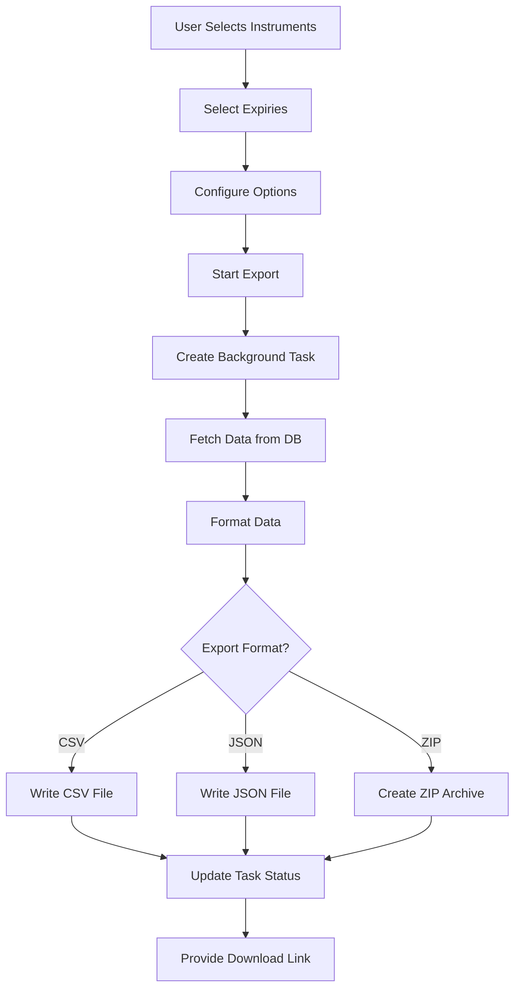

# Export Architecture Documentation

## Overview

ExpiryTrack provides comprehensive data export functionality through both web-based and command-line interfaces. The export system is designed to handle large-scale historical F&O data efficiently while maintaining data integrity and format consistency.

## Export System Components

### 1. Web-Based Export Wizard (`templates/export_wizard.html`)

The web interface provides a 4-step wizard for intuitive data export:

#### Step 1: Instrument Selection
- Select from pre-configured instruments (Nifty 50, Bank Nifty, Sensex)
- Multiple selection support with "Select All" option
- Visual indicators for selection status

#### Step 2: Expiry Selection
- Dynamic loading of available expiries per instrument
- Individual checkbox selection for granular control
- Expiry count display for each instrument
- Handles instrument names with special characters using `~~~` delimiter

#### Step 3: Export Options Configuration
- **Format Selection**: CSV, JSON, or ZIP
- **OpenAlgo Symbols**: Include standardized F&O symbology
- **Metadata Inclusion**: Add contract details (strike, option type)
- **Time Range**: All data or specific periods
- **File Organization**: Single file or separate files per contract

#### Step 4: Review and Export
- Summary display of all selections
- Real-time progress tracking
- Background task execution
- Download link generation upon completion

### 2. Export API Endpoints (`app.py`)

```python
/api/export/available-expiries  # POST - Get available expiries for instruments
/api/export/start               # POST - Start export task
/api/export/status/<task_id>    # GET - Check export progress
/api/export/download/<task_id>  # GET - Download exported file
```

### 3. Data Exporter Module (`src/export/exporter.py`)

Core export logic with the following methods:

```python
class DataExporter:
    def export_to_csv()   # CSV format with OpenAlgo symbols
    def export_to_json()  # Structured JSON with metadata
    def export_to_zip()   # Compressed archive with multiple files
```

## Data Format Specifications

### CSV Format

Standard column ordering with OpenAlgo symbols:

```csv
openalgo_symbol,date,time,timestamp,open,high,low,close,volume,oi
NIFTY16SEP25C22700,2025-09-05,15:17:00,2025-09-05T15:17:00+05:30,2115.0,2115.0,2114.3,2114.3,150,825
```

#### Column Descriptions:
- **openalgo_symbol**: Standardized F&O symbol format
- **date**: Trading date (YYYY-MM-DD)
- **time**: Trading time (HH:MM:SS)
- **timestamp**: ISO format timestamp with timezone
- **open**: Opening price
- **high**: High price
- **low**: Low price
- **close**: Closing price
- **volume**: Trading volume
- **oi**: Open Interest

### JSON Format

Hierarchical structure with metadata:

```json
{
  "metadata": {
    "exported_at": "2025-09-19T09:00:00",
    "instruments": ["NSE_INDEX|Nifty 50"],
    "format": "OpenAlgo",
    "version": "1.0"
  },
  "data": {
    "Nifty_50": {
      "2025-09-16": [
        {
          "openalgo_symbol": "NIFTY16SEP25C22700",
          "trading_symbol": "NIFTY 16SEP25 22700 CE",
          "strike": 22700,
          "option_type": "CE",
          "historical_data": [...]
        }
      ]
    }
  }
}
```

### ZIP Format

Archive structure:
```
OpenAlgo_ExpiryTrack_YYYYMMDD_HHMMSS.zip
├── NIFTY16SEP25C22700.csv
├── NIFTY16SEP25P22700.csv
├── BANKNIFTY16SEP25FUT.csv
└── metadata.json
```

## OpenAlgo Symbol Format

### Options
Format: `[BaseSymbol][DDMMMYY][Strike][CE/PE]`
- Example: `NIFTY16SEP25C22700` (Nifty 22700 Call expiring Sep 16, 2025)
- Example: `BANKNIFTY16SEP25P47500` (Bank Nifty 47500 Put)

### Futures
Format: `[BaseSymbol][DDMMMYY]FUT`
- Example: `NIFTY16SEP25FUT` (Nifty futures expiring Sep 16, 2025)

## Technical Implementation Details

### Background Task Processing

Export tasks run asynchronously to prevent UI blocking:

```python
# Task initialization
export_tasks[task_id] = {
    'task_id': task_id,
    'status': 'processing',
    'progress': 0,
    'status_message': 'Preparing export...',
    'file_path': None,
    'error': None
}

# Background thread execution
thread = threading.Thread(target=run_export)
thread.start()
```

### Progress Tracking

Real-time updates via polling mechanism:
- Status updates every second
- Progress percentage calculation
- Error handling and reporting
- File path generation upon completion

### Performance Optimizations

1. **Batch Processing**: Data fetched in chunks to manage memory
2. **Pandas DataFrame**: Efficient CSV writing with proper column ordering
3. **Streaming Writes**: Large datasets written progressively
4. **Connection Pooling**: Database connections reused for efficiency

### Error Handling

Comprehensive error management:
- Database connection failures
- Missing data handling
- Export format validation
- File system errors
- User permission issues

## Export Workflow



## Database Queries

Optimized queries for export operations:

```sql
-- Get contracts for expiry
SELECT * FROM contracts
WHERE instrument_key = ?
AND expiry_date = ?
ORDER BY strike_price, contract_type;

-- Get historical data
SELECT timestamp, open, high, low, close, volume, oi
FROM historical_data
WHERE expired_instrument_key = ?
ORDER BY timestamp;
```

## File Naming Convention

Consistent naming for easy identification:

```
OpenAlgo_ExpiryTrack_[Instrument]_[YYYYMMDD]_[HHMMSS].[ext]
```

Examples:
- `OpenAlgo_ExpiryTrack_Nifty_50_20250919_091456.csv`
- `OpenAlgo_ExpiryTrack_Bank_Nifty_20250919_091456.json`
- `OpenAlgo_ExpiryTrack_All_20250919_091456.zip`

## Security Considerations

1. **File Access**: Exports saved in dedicated `exports/` directory
2. **Task Isolation**: Each export runs in separate thread
3. **Resource Limits**: Memory and CPU usage monitored
4. **Cleanup**: Old export files can be automatically purged
5. **Access Control**: Download links require valid task ID

## Future Enhancements

1. **Scheduled Exports**: Cron-based automatic exports
2. **Cloud Storage**: Direct export to S3/Google Drive
3. **Custom Formats**: User-defined CSV columns
4. **Data Filtering**: Export specific strike ranges
5. **Compression Options**: Multiple compression algorithms
6. **Export Templates**: Save and reuse export configurations
7. **API Export Endpoints**: RESTful API for programmatic access
8. **Export History**: Track and manage previous exports

## Troubleshooting

### Common Issues and Solutions

1. **Empty CSV Files**
   - Cause: Incorrect expiry data format
   - Solution: Fixed delimiter parsing in JavaScript

2. **Missing Date/Time Columns**
   - Cause: Headers not updated for empty files
   - Solution: Added date/time to empty file headers

3. **Flask App Restart**
   - Cause: Auto-reload watching export directory
   - Solution: Disabled reloader with `use_reloader=False`

4. **Export Task Not Found**
   - Cause: Task dictionary cleared on app restart
   - Solution: Persistent task storage or disable auto-reload

## Testing Export Functionality

Test script available at `test_web_export.py`:

```python
python test_web_export.py
```

This script:
- Tests API endpoints
- Verifies export formats
- Validates data integrity
- Checks file generation
- Measures performance metrics